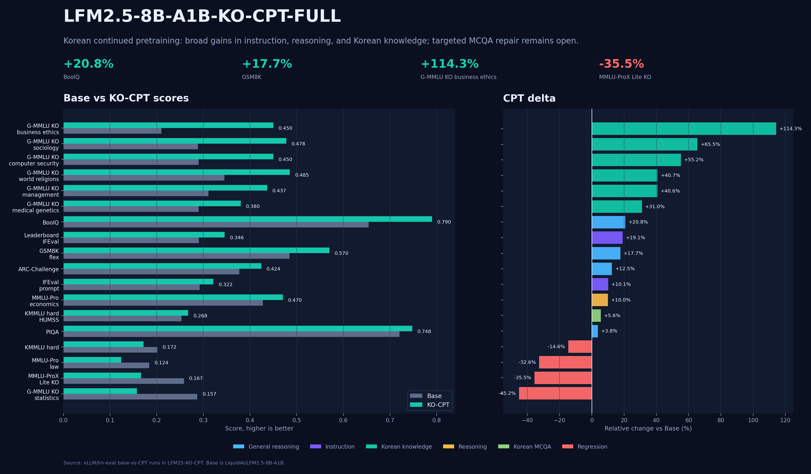

# LFM2.5 KO-CPT 데이터, 학습 방식, 효과 정리

작성일: 2026-06-30  
대상 모델: `LLM-OS-Models/LFM2.5-8B-A1B-KO-CPT-FULL`  
베이스 모델: `LiquidAI/LFM2.5-8B-A1B`

이 문서는 KO-CPT가 어떤 데이터로 학습됐고, 어떤 방식으로 전처리/학습됐으며,
그 결과 어떤 성능 변화가 있었는지 한 번에 보기 위한 한국어 설명서다.

## 한 줄 결론

KO-CPT는 한국어 도메인 지식과 일부 일반 벤치마크를 확실히 끌어올렸다. 특히
BoolQ, GSM8K, ARC, IFEval, Global MMLU Korean 일부 과목에서 상승이 확인됐다.
다만 KMMLU hard, MMLU-ProX Lite KO, 법률/통계/STEM식 다지선다와 정확답 추출은
하락했다. 즉, CPT는 지식 이식에는 효과가 있었지만, 객관식 선택지 매핑과 짧은
정답 출력은 별도의 targeted post-training이 필요한 상태다.

## 전체 학습 산출물

| 항목 | 값 |
|---|---:|
| 최종 학습 rows | 4,622,971 |
| 문자 수 | 11,581,567,658 |
| 추정 토큰 수 | 6.493B tokens |
| 학습 epoch | 1 |
| context length | 8,192 |
| final steps | 10,196 |
| final train loss | 약 0.712 |
| 학습 방식 | full-parameter continued pretraining |
| 학습 하드웨어 | 8 x H200 |
| 최종 checkpoint | `checkpoint-10196` 기반 `final_full` 재구성 |

토큰 수는 로컬 LFM tokenizer 샘플링에서 확인한 한국어 평균치인 약
`1.78 chars/token`을 사용한 추정치다. 실제 trainer는 packing 후 10,196 step으로
1 epoch를 완료했다.

## 어떤 데이터로 학습했나

최초 입력 config에는 10개 source가 있었다. 이 중 finance 계열에 중복된 원천이
있었고, 전역 deduplication 후 최종 학습 mix에는 9개 source family가 남았다.
최종 merged stats 기준 `duplicate_global=1,861,531` rows가 제거됐다.

| source | 역할 | 최종 rows | 문자 수 | shard 크기 |
|---|---|---:|---:|---:|
| `kowiki_raw_full_20260524` | 한국어 일반 지식, 위키 문체, 설명체 | 611,403 | 922,602,857 | 2.06GB |
| `bcai_finance_kor_hrm_20260524` | 금융/회계/재무 용어와 설명 | 1,861,531 | 2,414,230,984 | 5.68GB |
| `korean_legal_raw_full_20260523` | 법령/판례/법률 문서 장문 분포 | 227,687 | 789,324,880 | 1.80GB |
| `korean_legal_tasks_full_20260524` | 법률 QA, 시험형 문제, instruction-like 법률 태스크 | 1,383,340 | 1,813,366,700 | 4.13GB |
| `korean_admrule_precedent_raw_full_20260524` | 행정규칙/판례형 전문 문서 | 203,477 | 719,804,895 | 1.68GB |
| `ko_legal_source_agent_sft_20260621` | 근거 문서 기반 법률 agent/RAG 답변 | 5,999 | 60,652,338 | 0.12GB |
| `ko_legal_rag_agent_sft_round15_v2` | 추가 법률 RAG agent 답변 | 749 | 7,656,157 | 0.01GB |
| `current_law_bar_json_answer_sft_20260621` | 현행법 기준 변시형 JSON 정답/선택지 구조 | 2,000 | 4,693,801 | 0.01GB |
| `lfm25_terminal_toolbench_hrm_turns_v1` | 터미널/tool-use/agent trace 보존 | 326,785 | 4,849,235,046 | 5.05GB |

## 데이터별 기대 효과

| 데이터군 | 기대한 효과 | 실제 관찰 |
|---|---|---|
| Korean Wiki | 한국어 일반 문장 분포, 지식형 설명 강화 | Global MMLU Korean 일부 과목 상승 |
| Finance | 금융/회계 용어, 재무 설명, 숫자 포함 텍스트 적응 | 일부 지식/설명 능력 강화, 회계형 exact task는 별도 보강 필요 |
| Legal raw | 법령/판례/행정규칙의 긴 문체와 전문 용어 적응 | 법률 텍스트 친화성은 올라갔지만 객관식 법률 선택은 충분히 개선되지 않음 |
| Legal tasks | 질의응답과 시험형 구조 노출 | 법률/근거형 답변 기반은 형성, 짧은 선택지 매핑은 불안정 |
| Legal RAG/source agent | 근거를 읽고 답하는 습관, source-grounded answer | 추후 RAG/하네스와 결합할 기반 역할 |
| Current-law bar JSON | `정답`, 선택지, JSON 구조 감각 | 규모가 작아 변시 다지선다 안정화에는 부족 |
| Terminal ToolBench | LFM tool-use, terminal log, agent trace 분포 보존 | CPT 단계에서 tool/chat 형식이 완전히 지워지는 것을 방지 |

## 전처리는 어떻게 했나

1. Source별 JSONL을 읽고 category/kind에 따라 raw text, domain text,
   instruction-as-text, agent text로 나눴다.
2. 한국어 source에는 hangul ratio 필터를 적용했다.
3. terminal/toolbench source는 영어 trace가 많으므로 source별 override로
   `min_hangul_ratio=0.0`을 적용했다.
4. source 내부 중복과 전체 mix 전역 중복을 제거했다.
5. instruction/RAG/tool 샘플은 LFM ChatML-like text로 감쌌다.
6. tool-call 형식은 LFM 문서의 `<|tool_call_start|>`, `<|tool_call_end|>` 경계를
   보존하는 방향으로 유지했다.
7. full raw mix와 source-separated shard를 모두 남겨, 어떤 데이터가 들어갔는지
   나중에 감사할 수 있게 했다.

핵심 산출물:

| 산출물 | 경로 |
|---|---|
| full LFM-style mix | `/home/work/.data/lfm2_ko_cpt/datasets/ko_cpt_mix_full_lfmstyle_20260627.jsonl` |
| stats | `/home/work/.data/lfm2_ko_cpt/datasets/ko_cpt_mix_full_lfmstyle_20260627.stats.json` |
| full report | `/home/work/.data/lfm2_ko_cpt/datasets/ko_cpt_mix_full_lfmstyle_20260627.stats.json.full_report.json` |
| source shards | `/home/work/.data/lfm2_ko_cpt/datasets/shards_full_lfmstyle_20260627` |

## 학습은 어떻게 했나

KO-CPT는 LoRA가 아니라 full-parameter CPT다. 목적은 instruction tuning이 아니라
한국어/도메인 분포를 모델 파라미터에 직접 주입하는 것이다.

| 항목 | 설정 |
|---|---:|
| launcher | `torchrun --nproc_per_node=8` |
| max sequence length | 8,192 |
| per-device batch | 2 |
| gradient accumulation | 4 |
| effective batch | 64 sequences/update |
| upper token/update | 524,288 |
| optimizer | `adamw_8bit` |
| gradient checkpointing | enabled |
| learning rate | `2e-5` |
| save steps | 1,000 |
| save total limit | 4 |
| epochs | 1 |

왜 8k context를 썼는가:

- 법령/판례/RAG/terminal trace는 4k보다 긴 샘플이 많다.
- 8 x H200에서 full-parameter CPT를 안정적으로 돌릴 수 있는 현실적 길이다.
- 16k/32k 이상은 별도 long-context 실험이 필요하고, 이번 CPT 목적은 먼저
  한국어 분포와 도메인 지식 이식이었다.

왜 1 epoch만 했는가:

- 이미 강한 LFM2.5 base를 대상으로 하는 domain CPT라서, 여러 epoch는 기존
  일반 능력과 instruction 분포를 더 흔들 수 있다.
- 실제 결과에서도 지식/일반 벤치 일부는 올랐지만 MCQA/exact-answer가 하락했다.
  따라서 추가 CPT 반복보다 targeted repair가 맞다는 판단이 나왔다.

## 성능은 어떻게 변했나

전체적으로 CPT는 좋은 효과와 부작용이 동시에 나왔다. 모델 카드에는 좋은 점과
나쁜 점을 같이 적어야 한다. 좋은 점만 쓰면 후속 SFT/repair의 목표가 흐려진다.

### 강하게 오른 항목

| Benchmark | Base | KO-CPT | 변화 |
|---|---:|---:|---:|
| BoolQ full | 0.6544 | 0.7902 | +20.75% |
| GSM8K full 5-shot flexible | 0.4845 | 0.5701 | +17.67% |
| ARC-Challenge full | 0.3771 | 0.4241 | +12.44% |
| IFEval full prompt loose | 0.2921 | 0.3216 | +10.10% |
| Leaderboard IFEval prompt loose | 0.2902 | 0.3457 | +19.11% |
| Global MMLU KO business ethics | 0.2100 | 0.4500 | +114.29% |
| Global MMLU KO sociology | 0.2886 | 0.4776 | +65.52% |
| Global MMLU KO computer security | 0.2900 | 0.4500 | +55.17% |
| Global MMLU KO world religions | 0.3450 | 0.4854 | +40.70% |

### 하락한 항목

| Benchmark | Base | KO-CPT | 변화 |
|---|---:|---:|---:|
| MMLU-ProX Lite KO | 0.2585 | 0.1667 | -35.53% |
| KMMLU hard | 0.2015 | 0.1720 | -14.63% |
| KMMLU hard STEM | 0.1973 | 0.1564 | -20.74% |
| Global MMLU KO high school statistics | 0.2870 | 0.1574 | -45.16% |
| Global MMLU KO astronomy | 0.3421 | 0.2829 | -17.31% |
| MMLU-Pro law | 0.1840 | 0.1240 | -32.61% |

## 결과 해석

이 결과는 “한국어가 전반적으로 좋아졌다/나빠졌다”로 단순화하면 안 된다.
정확한 해석은 다음에 가깝다.

- 한국어 지식 주입과 도메인 문체 적응은 성공했다.
- 일반 QA/추론 일부도 보존되거나 상승했다.
- 그러나 한국어 hard multiple-choice, 정확한 선택지 라벨 출력, parser-sensitive
  exact-match 태스크는 약해졌다.
- 즉, CPT가 지식을 넣는 데는 효과적이지만, 다지선다 행동을 보존하거나 고치는
  학습은 아니다.

특히 변호사시험/법률 객관식에서는 법령과 판례를 많이 읽었다는 것만으로는
부족하다. 실제 병목은 지문별 O/X 판단, `ㄱ/ㄴ/ㄷ/ㄹ` 조합, `①~⑤` 선택지 번호
매핑, 마지막 `정답: N` 형식 고정이다. 이 부분은 별도의 evaluator, grounded
context, RAG/하네스, 작고 엄격한 SFT 또는 adapter가 필요하다.

## 이후 SFT 실험에서 확인된 점

후속 KO-SFT, Agentic/Fable, Repair-SFT, BarExamV5-SFT는 broad public benchmark를
복구하지 못했다. 오히려 verbose assistant 분포로 이동하면서 MCQA/exact-answer
점수가 더 깨질 수 있다는 점이 확인됐다.

따라서 현재 대표 모델은 KO-CPT다. 후속 실험들은 실패를 숨기는 것이 아니라,
왜 일반 SFT가 답이 아니었는지 보여주는 재현 가능한 negative result로 남긴다.

## 다음에 다시 한다면

추가 broad CPT를 바로 반복하는 것은 우선순위가 낮다. 이미 CPT로 얻은 지식
이식 효과는 확인됐고, 지금 병목은 지식 부족보다 선택형/정확답 행동이다.

다음 시도는 다음 조건을 만족해야 한다.

| 항목 | 권장 |
|---|---|
| 시작점 | KO-CPT |
| 데이터량 | 5M-20M tokens부터 작은 repair |
| 학습률 | `2e-7` ~ `5e-7` |
| 방식 | LoRA/adapter 또는 아주 짧은 full SFT |
| 데이터 | answer-only MCQA, 선택지 번호 매핑, 짧은 rationale, train-only evidence QA |
| 제외 | 긴 chat-only, full solution 과다, terminal trace 과다 |
| gate | 100/300/500 step마다 BoolQ, ARC, GSM8K, IFEval, KMMLU, MMLU-ProX, 변시 custom |
| 중지 기준 | KO-CPT 대비 하락하면 즉시 폐기 |

## 공개 카드에서 말해야 할 메시지

이 모델은 “완성된 한국어 instruction model”이 아니라 “한국어 도메인 CPT 기준점”이다.
홍보할 때는 다음처럼 말하는 것이 가장 정확하다.

- KO-CPT는 Base 대비 여러 한국어 지식/일반 벤치마크를 올렸다.
- 동시에 한국어 hard MCQA와 exact-answer 계열 하락도 있다.
- 대표 공개 checkpoint는 KO-CPT이며, SFT 계열은 실패 분석과 재현용이다.
- 변시/법률 다지선다는 단독 모델 생성보다 grounded context + strict option
  mapping workflow가 필요하다.
